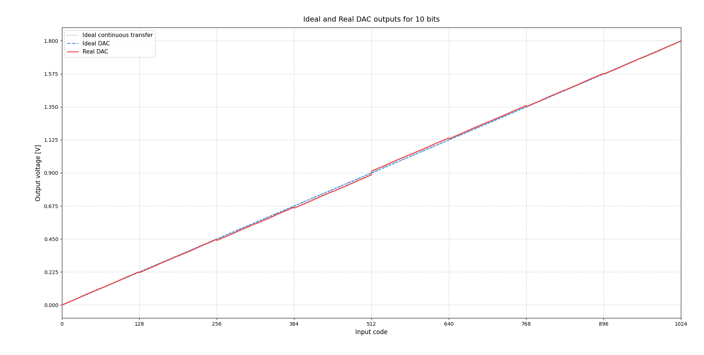
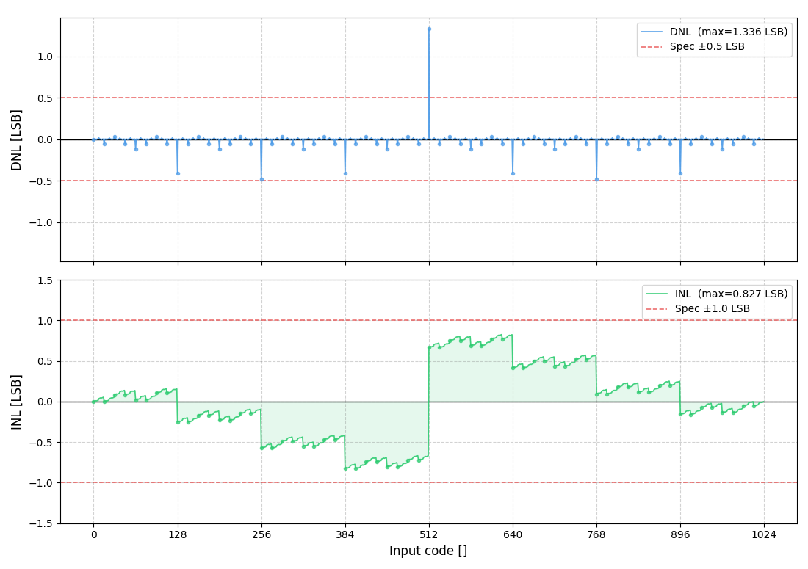
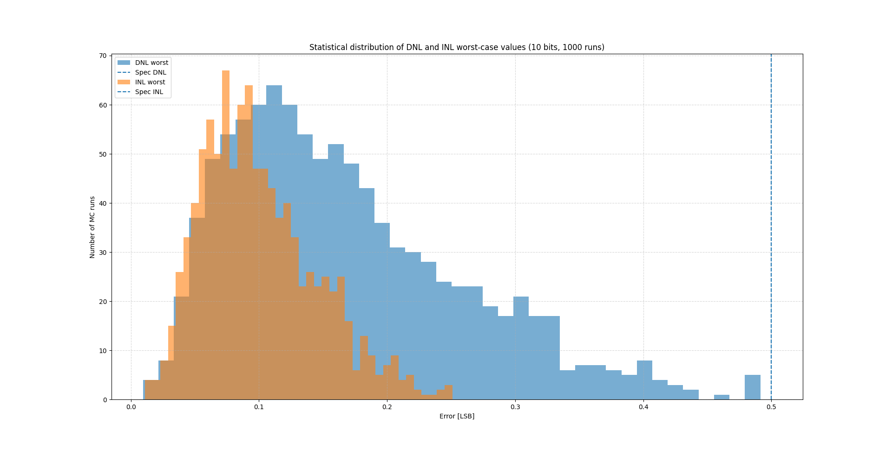

# DAC R-2R Analytical Simulator

This folder contains an analytical simulation environment developed in Python, designed to study the theoretical and statistical behavior of a Digital-to-Analog Converter (DAC) with R-2R ladder architecture.

The code was developed as part of the theoretical study and validation tools for the *Práctica Profesional Supervisada* (PPS) in Electronics Engineering at UTN FRLR.

Unlike post-layout extractions, this environment does not evaluate a physical circuit. Instead, it acts as a mathematical experimentation framework to predict how design variations affect converter performance.

---

## Objectives

1. **Stochastic Mismatch Simulation:** Introduce statistical tolerances into the R and 2R resistor network following Pelgrom's mismatch model, and observe the resulting degradation of the ideal transfer curve.

2. **Static and Dynamic Metrics:** Mathematically compute the impact of these variations on static metrics (DNL, INL) and dynamic metrics (ENOB, SNR, THD, SINAD).

3. **Parametric Analysis and Trade-offs:** Generate trend curves to evaluate the limits of the architecture:
   - Resolution vs. worst-case DNL / INL
   - Resolution vs. ENOB
   - Manufacturing yield analysis against DNL / INL specifications

---

## Project Structure

```
.
├── main.py                  # Interactive simulator entry point
├── dac_logic.py             # DAC class: all parameters, data, and analysis methods
├── mismatch_simulation.py   # R-2R ladder circuit model with Pelgrom mismatch
├── enob_test.py             # Spectral analysis functions (FFT, SNR, THD, SINAD, ENOB)
│
└── standalone/              # Independent analysis scripts (batch / research use)
    ├── bits_vs_nl.py            # Parametric sweep: resolution vs. DNL/INL (Monte Carlo)
    ├── enob_vs_bits.py          # Parametric sweep: resolution vs. ENOB (Monte Carlo)
    └── yield_dnl_inl.py         # Yield estimation via Monte Carlo
```

> **Note:** The standalone scripts are self-contained and can be run directly without `main.py`. They use `mismatch_simulation.py` and `enob_test.py` as dependencies.

---

## Interactive Simulator

The main entry point is `main.py`, which exposes a terminal menu that wraps the `DAC` class defined in `dac_logic.py`. All simulator state (resolution, Vref, Fs, geometry, generated curve, and analysis results) lives inside a single `DAC` object.

```bash
python main.py
```


### Typical Workflow

1. Adjust system or physical parameters via options 1–5.
2. Generate a DAC instance with a specific mismatch seed (option 6), or load a previously saved curve from CSV (option 7).
3. Run static analysis: inspect worst-case DNL/INL (option 9) and visualize the transfer function and error profiles (option 10).
4. Set the test tone frequency (option 11) and run dynamic analysis: compute ENOB/SINAD (option 12) and plot the power spectrum (option 13).
5. Optionally save the generated curve to CSV for reproducibility (option 8).

### Some Results

In this figure, you can see a transfer curve result, for 10 bits, and 13LSB DNL, the reason why in the midrange the real transfer curve draws a jump. Also, EBNO=6.84bits for 1MHz.



Next figure shows how INL/DNL profiles, and their maximum values.



One of the standalone scripts does a MC test to determine if the designs satisfies INL/DNL specs across R variations, and obtain the yield.



---

## Core Modules

### `mismatch_simulation.py`

Implements the R-2R ladder circuit model. Resistor values are drawn from a normal distribution following Pelgrom's law:

$$\sigma_{\Delta R / R} = \frac{A_R}{\sqrt{W \cdot L}}$$

The nodal admittance matrix **Y** is assembled for the ladder topology and inverted once per simulation instance. All $2^n$ output voltages are then computed via matrix-vector multiplication `V = Z · I`, where the current vector **I** encodes the digital input code.


### `enob_test.py`

Provides the spectral analysis pipeline. Functions can be imported independently (the standalone demo at the bottom of the file is protected by `if __name__ == "__main__"`).

| Function | Description |
|---|---|
| `generar_seno_digital(bits, N, k)` | Generates a coherent digital sine wave at bin `k` |
| `simular_dac(LUT, D)` | Maps digital codes to real output voltages via the transfer curve |
| `calcular_espectro_potencia(V_out)` | Computes the single-sided power spectrum (DC-removed, normalized FFT) |
| `calcular_metricas_espectrales(P, k)` | Returns SNR, THD, SINAD, and ENOB from the power spectrum |

### `dac_logic.py` — `DAC` class

Centralizes all simulator state and logic. Parameters, generated data, and cached analysis results are stored as instance attributes. Analysis methods are lazy: results are computed on first call and cached until new data is loaded.

| Attribute | Default | Description |
|---|---|---|
| `bits` | 10 | DAC resolution |
| `vref` | 3.3 V | Reference voltage |
| `fs` | 100 MHz | Clock / sampling frequency |
| `r_nom` | 10 kΩ | Nominal resistor value |
| `a_rho` | 0.002 | Pelgrom mismatch constant |
| `w`, `l` | 1.0, 25.0 µm | Resistor geometry |
| `f_in_k` | 7 | Coherence bin for dynamic test |
| `N` | 4096 | FFT length |

**`f_in_hz` property** — automatically computes the equivalent physical frequency from the coherence bin:

$$f_{in} = k \cdot \frac{F_s}{N}$$

---

## Standalone Analysis Scripts

These scripts perform batch analyses and generate publication-quality plots. They are independent from `main.py` and are intended for parametric sweeps or Monte Carlo studies.

| Script | Analysis |
|---|---|
| `bits_vs_nl.py` | Sweeps resolution from 4 to 12 bits; plots mean and P95 worst-case DNL/INL via Monte Carlo |
| `enob_vs_bits.py` | Sweeps resolution from 4 to 15 bits; plots ENOB distribution as boxplots vs. nominal bits |
| `yield_dnl_inl.py` | Runs 1000-sample Monte Carlo at 10 bits; estimates manufacturing yield against DNL/INL specs |
| `dac_simulator.py` | Generates transfer function + DNL/INL profiles for a single DAC instance (10-bit example) |
| `dac_transfer_graphs.py` | Minimal 3-bit transfer function example with manual V_real values |
| `dnl_inl_graphs.py` | Annotated DNL/INL stem plots for a 3-bit manual example |

---

## Requirements

Python 3.x. Install dependencies in a virtual enviroment with:

```bash
python3 -m venv venv
source venv/bin/activate
pip install numpy matplotlib
```

> `scipy` is not required by any current module and can be omitted.

---

## License

This program is free software distributed under the terms of the [GNU General Public License v3.0](https://www.gnu.org/licenses/gpl-3.0.html).